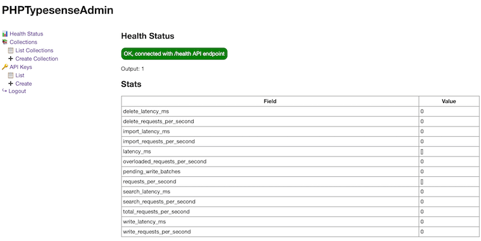

# PHPTypesenseAdmin

PHPTypesenseAdmin is a simple administration panel designed to interact with [Typesense](https://typesense.org/), an open-source, typo-tolerant search engine that provides instant search experiences for your applications. This project aims to provide an easy-to-use interface for managing your Typesense instance, including functionalities such as viewing collections, documents, and managing API keys.

## Screenshots

Login Screen:


Dashboard:


## Functionalities

- Health Status
- Collections
-- List Collections
-- Create Collection
-- Update Collection
-- Delete Collection
-- Creation of Export / Import Collection curl prompts
- API Keys
-- List Keys
-- Delete Key
-- Create Key

## Installation

To get started with PHPTypesenseAdmin, follow the steps below:

### 1. Clone the Repository

First, clone this repository to your local machine or server. You can do this by running:

```sh
git clone https://github.com/devproblemssolutions/PHPTypesenseAdmin.git
cd PHPTypesenseAdmin
```

Replace `https://github.com/devproblemssolutions/PHPTypesenseAdmin.git` with the actual URL of your repository.

### 2. Configuration

Create an `env.php` file in the root directory of your project. You can do this by copying the provided `env.example.php` to `env.php` or creating a new `env.php` file:

```sh
cp env.example.php env.php
```

or

```sh
touch env.php
```

Then, open `env.php` and update the configuration variables accordingly:

```php
<?php
$correctUsername = 'admin'; // CHANGE
$correctPassword = 'password'; // CHANGE

$typesenseProtocol = 'https'; // CHANGE
$typesenseApiKey = 'YOURAPIKEY'; // CHANGE
$typesenseHost = 'HOST'; // CHANGE
$typesensePort = 443; // CHANGE
```

Make sure to replace the placeholder values with your actual Typesense server details and desired admin login credentials.

### 3. Install Dependencies

Run the following command to install necessary PHP dependencies via Composer:

```sh
composer install
```

### 4. Server Configuration

For security reasons, ensure that only the `public` directory is accessible to web traffic. If deploying to a live server, consider running this panel locally or configuring it to be accessible only behind an IP firewall.

**Important**: PHPTypesenseAdmin is in its early development stages. There might still be bugs and potential security vulnerabilities. Please take this into consideration, and avoid running this software in a production environment.

## Usage

After completing the installation steps, you can start using the PHPTypesenseAdmin by navigating to the public directory in your web browser. Log in using the credentials you specified in `env.php` to manage your Typesense instance.

## Contributing

Contributions, issues, and feature requests are welcome. Feel free to check [issues page](https://github.com/devproblemssolutions/PHPTypesenseAdmin/issues) if you want to contribute.

## Disclaimer

All use of this software is at your own risk. While effort has been made to ensure security and stability, there may still be undetected bugs or vulnerabilities. The author(s) or contributors bear no responsibility for any damage or data loss incurred.

---

Remember to replace placeholders like `https://github.com/devproblemssolutions/PHPTypesenseAdmin.git` and links to the issues page with actual links relevant to your GitHub repository. Expand this README as needed to include more detailed information about your project, how to use it, and how others can contribute.